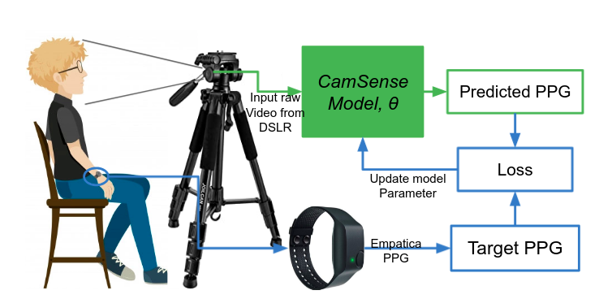
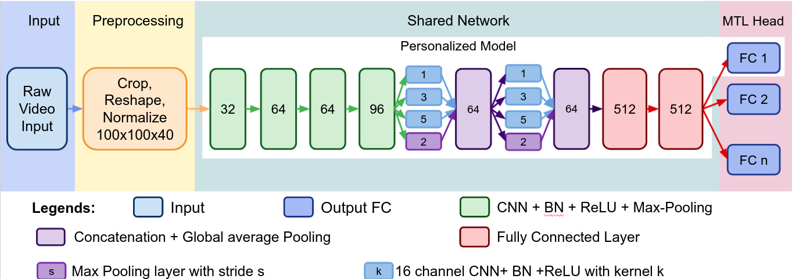
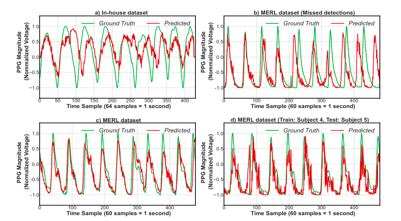
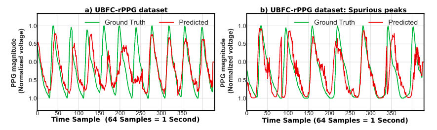
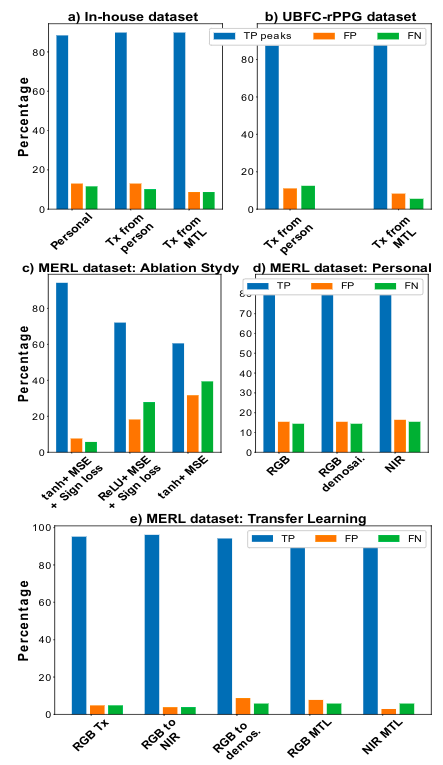
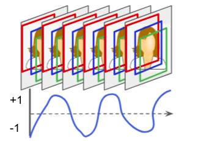

# MPSC lab: rPPG

In this research work, We aim to implement multi task learning based neural network to extract robust PPG from the Heart Rate.

This cite contains the codes to reproduce the results, collected data description, and sample analysis resutls.

# Abstract

Remote Photoplythysmograpy (rPPG) systems enable contactless heart activities (heart rate, heart rate variability) monitoring by estimating Photoplethysmogram (PPG) signal, blood's volumetric variation in the skin tissues, leveraging the occurred diffused reflection from the exposed skin in skin video. They can primarily monitor heart activities using off-the-shelf video sensors while ensuring the safety of concerned individuals during contagious diseases. However, developing the rPPG systems is challenging due to the marginal presence of PPG signal in the video stream, data variations, limited and noisy rPPG data. In this regard, we propose an end-to-end deep learning-based approach for camera-based contactless sensing "CamSense" for recovering PPG signals from consecutive raw video frames. Firstly, we design and validate a personalized model to bypass data variation and noise across data collection with a modified objective function under realistic settings. Secondly, we explore and design multi-task learning (MTL) network to address the rPPG data variabilities for learning generalized rPPG representations. We also propose a transfer learning approach that integrates an efficient weight initialization to scale the rPPG systems under different domains and settings for fast and generalized training and inferences. Finally, we propose a new 'in-house' rPPG dataset containing multiple RGB videos and corresponding PPG ground truth for end-end rPPG network training. We evaluate CamSense on two public datasets and our 'in-house' dataset across multiple subjects and heterogeneous camera sensors such as DSLR and near-infrared sensors with different ground truth provider PPG sensors (wrist, finger) to showcase its' generalizability. We further validate our components' design choices by performing ablation studies using different settings. Our developed model approximates accurate PPG signals with an average root mean square error (RMSE) of $0.08$, $0.10$, and $0.06$  for personalized models, MTL model, and transfer learnings using the held-out test videos.

### rPPG

rPPG (remote Photoplethysmogram) signal measures the volumetric variation in the uncovered skin tissues from the video streams. This blood variation in the skin is the direct result of rhythmic heart activities.

# Our Methodologies

Figure: Our Overview of data collection and model development.

Figure: Utilization of the Multi head network to learn from multiple video simultaneous in the CamSense. The Multi head allows the model to disregards the data alignment issues and encounter sensor heterogeneity. The architecture also allows us to combine data from multiple sources.

# Sample results

Figure: Sample result of PPG approximation using the CamSense Network.

Figure: Sample result of PPG approximation using the transfer learning using the base CamSense Network.

Figure: Overall result summary using the CamSense Model and its design choices.

# Data Collection:

Figure: Sample rPPG data to learn complete PPG information from raw video frames. There is PPG corresponding the video frames. 

To  collect  video  with  enough  PPG  signal and well-aligned PPG, we collect simultaneous PPG and video sensor  data.  We  collected  HD  video  using  RGB  stationery(in  a  stand)  DSLR  (Canon  D3500)  at  30  fps  in  a  laboratory setup under artificial light for 5 minutes while each volunteer was  sitting  idly  on  a  chair  three  feet  away  in  front  of  the camera.  Concurrently,  Empatica  E4  Wristwatch  tracks  the wrist PPG sampled at 64 Hz from volunteers’ dominant hand.To  align  the  video  and  PPG  data  to  the  same  time-stamp, we  leveraged  the  event  marker  feature  in  the Empatica  E4.During  that,  the  volunteers  count  to  ten  for  10  seconds.  We identified  the  exact  position  of  the  event  marker  press  of Empatica E4 by locating event marker light at particular video frames.  The  Empatica  E4  locates  the  exact  PPG  position  for the  event  markers  pressed.  This  allows  us  to  align  PPG  andvideo  with  an  error  margin  of  1/30  seconds.  

The  dataset consists of two females, six males volunteers. Our dataset has included person heterogeneity such as sex, facial hair, fitness level,  and  spectacles  usage.  Two  male  volunteers  provided data  with  and  without  a  beard  and  glass.  All  subjects  are healthy  and  have  no  known  medical  condition  having  HR ranges  from  50  BPM  to  95  BPM.  In  RGB  video  times,  our dataset suppressed both public datasets, and suitable for developing  generalized  DL  models.  Moreover,  the  in-house dataset  introduces  heterogeneity  by  placing  the  PPG  sensor at the wrist.

|No of subs | Collections | Data Length | Data Variety |
|-----|--------|------------------|-----------------------------|
| 9 | 14 | \~ 2 hours (\~ 200K frames) | Regular, Gender, Light, Beard, Glass, Sensor, Distance |

We have received the kind consent of the volunteers to collect their data and followed instructional Review Board (IRB) protocol during the data collection.

Please contact us to get the access to rPPG data. Upon receiving request and agreement, we will share the drive link to download the videos and corresponding Empatica PPG signal. The instructions and python source code will also be provided to align the video with the PPG signal for training and validation.

# Citation:

[Coming Soon]
